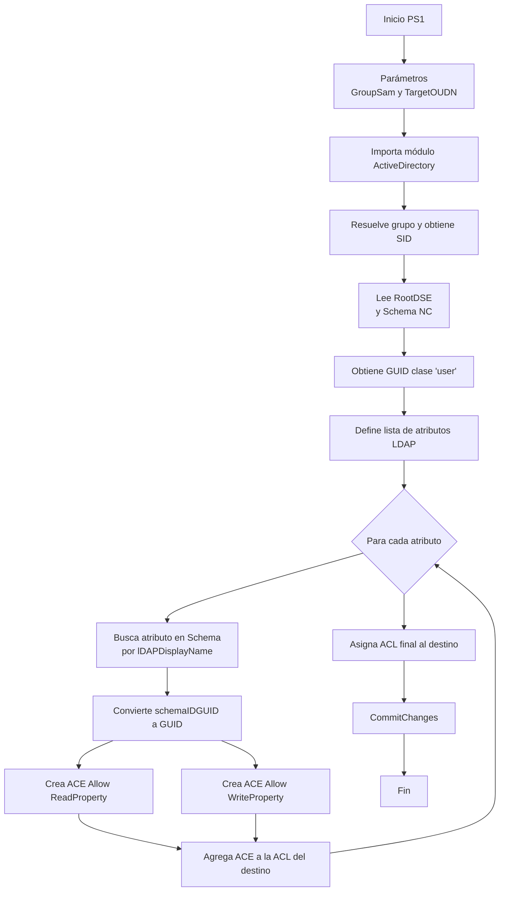

# Delegación granular de atributos en Active Directory (raíz del dominio)  
**Fecha:** 2026-02-09  
**Propósito:** Delegar a un **grupo** permisos **granulares** para **leer y modificar** atributos específicos de **objetos Usuario (user)** en **todo el dominio** (aplicado en la **raíz**: `DC=...`).

> ⚠️ **Advertencia (importante):** Aplicar esto en la **raíz del dominio** hace que la delegación se **herede a todas las OUs/containers** bajo el dominio (salvo donde la herencia esté bloqueada). Úsalo solo si realmente quieres cobertura global.

---

## Alcance solicitado

- **Se aplica a un solo contenedor:** la **raíz del AD (dominio)**, por ejemplo:  
  - `DC=UUU,DC=xy,DC=xy`  
  - `DC=empresa,DC=local`
- **Objetos afectados:** **solo** descendientes de clase **`user`** (no computadoras, grupos, contactos, etc.)
- **Atributos delegados (LDAP):**
  - `employeeID`
  - `physicalDeliveryOfficeName`
  - `streetAddress`
  - `l` (ciudad)
  - `st` (provincia/estado)
  - `title`
  - `department`
  - `company`
  - `manager`
- **Derechos delegados:**  
  - `ReadProperty` (leer el atributo)  
  - `WriteProperty` (escribir el atributo)

---

## Qué hace el PS1 (paso a paso)

1. **Recibe parámetros**
   - `GroupSam`: el **SAMAccountName** del grupo a delegar
   - `TargetOUDN`: el DN del contenedor donde aplicar la ACL (en este caso, la **raíz del dominio**, `DC=...`)

2. **Carga el módulo de AD**
   - Importa `ActiveDirectory` (RSAT)

3. **Resuelve el grupo y obtiene su SID**
   - Las ACL de AD guardan el **SID** del principal, no el nombre

4. **Ubica el Schema**
   - Obtiene `schemaNamingContext` desde `RootDSE`

5. **Obtiene el GUID de la clase `user`**
   - Para restringir la herencia a **solo objetos user**

6. **Por cada atributo**
   - Busca el atributo en el Schema por `lDAPDisplayName`
   - Extrae el `schemaIDGUID` y lo convierte a `Guid`

7. **Crea dos ACE por atributo**
   - Allow + `ReadProperty` (para el GUID del atributo)
   - Allow + `WriteProperty` (para el GUID del atributo)
   - Herencia: `Descendents`
   - Tipo de descendiente: `user`

8. **Agrega todas las ACE a la ACL del contenedor**
   - Modifica el `ObjectSecurity` del contenedor destino

9. **Commit**
   - Guarda los cambios con `CommitChanges()`

10. **Soporta `-WhatIf`**
   - Modo simulación para revisar antes de aplicar.

---

## Diagrama Mermaid del flujo



---

## Requisitos

- Windows con **RSAT** instalado (herramientas de AD)
- PowerShell con el módulo **ActiveDirectory**
- Ejecutar la consola con una cuenta que tenga permisos para **modificar ACL** del contenedor destino (raíz del dominio)

---

## Uso recomendado (raíz del dominio)

### 1) Identifica el DN del dominio
Ejemplo:
- `DC=uned,DC=ac,DC=cr`

Puedes obtenerlo con:
- `Get-ADDomain | Select-Object -ExpandProperty DistinguishedName`

### 2) Prueba en modo simulación
```powershell
.\Grant-AdUserAttributePerms.ps1 `
  -GroupSam "SG_AD_Users_Edit" `
  -TargetOUDN "DC=uned,DC=ac,DC=cr" `
  -WhatIf
```

### 3) Aplica cambios
```powershell
.\Grant-AdUserAttributePerms.ps1 `
  -GroupSam "SG_AD_Users_Edit" `
  -TargetOUDN "DC=uned,DC=ac,DC=cr"
```

---

## Verificación rápida

- **ADUC** → activar **View > Advanced Features**
- Click derecho sobre el dominio (raíz) → **Properties**
- **Security** → **Advanced**
- Debes ver entradas para el grupo con permisos de propiedades (atributos) heredables.

---

# Código fuente PS1 (completo)

> ✅ Copia/pega este archivo como: `Grant-AdUserAttributePerms.ps1`

```powershell
<#
.SYNOPSIS
  Delegates granular AD attribute permissions (Read/Write Property) to a group
  on a target container (domain root or OU) for User objects only.

.DESCRIPTION
  Adds explicit ACEs on the target container's ACL, inheritable to descendant
  objects of class 'user', granting ReadProperty and WriteProperty for a set
  of specific attributes.

.REQUIREMENTS
  - RSAT ActiveDirectory module
  - Run in a PowerShell session that already has rights to modify ACLs
    on the target container (e.g., delegated control or Domain Admin).

.NOTES
  - Do NOT prompt for or store "master passwords" in scripts.
  - Prefer running PowerShell as a delegated admin user or via "Run as different user".

.EXAMPLE
  # Domain root
  .\Grant-AdUserAttributePerms.ps1 -GroupSam "SG_AD_Users_Edit" -TargetOUDN "DC=uned,DC=ac,DC=cr" -WhatIf

.EXAMPLE
  # Apply
  .\Grant-AdUserAttributePerms.ps1 -GroupSam "SG_AD_Users_Edit" -TargetOUDN "DC=uned,DC=ac,DC=cr"
#>

[CmdletBinding(SupportsShouldProcess=$true, ConfirmImpact="High")]
param(
  [Parameter(Mandatory)]
  [string]$GroupSam,

  [Parameter(Mandatory)]
  [string]$TargetOUDN
)

$ErrorActionPreference = "Stop"

Import-Module ActiveDirectory

# --- Resolve group SID ---
$group = Get-ADGroup -Identity $GroupSam -Properties objectSid
if (-not $group) { throw "No se encontró el grupo: $GroupSam" }
$groupSid = New-Object System.Security.Principal.SecurityIdentifier($group.objectSid.Value)

# --- Attributes to delegate (LDAP display names) ---
$attrs = @(
  "employeeID",
  "physicalDeliveryOfficeName",
  "streetAddress",
  "l",
  "st",
  "title",
  "department",
  "company",
  "manager"
)

# --- Resolve Schema naming context ---
$rootDse = Get-ADRootDSE
$schemaNC = $rootDse.schemaNamingContext

function Get-AttributeGuid {
  param([Parameter(Mandatory)][string]$LdapDisplayName)

  $attrObj = Get-ADObject -SearchBase $schemaNC -LDAPFilter "(lDAPDisplayName=$LdapDisplayName)" -Properties schemaIDGUID
  if (-not $attrObj) { throw "No se encontró el atributo en Schema: $LdapDisplayName" }

  # schemaIDGUID comes as byte[]
  $bytes = $attrObj.schemaIDGUID
  return New-Object Guid (,$bytes)
}

# --- User class GUID (so it applies to user objects) ---
$userClass = Get-ADObject -SearchBase $schemaNC -LDAPFilter "(lDAPDisplayName=user)" -Properties schemaIDGUID
if (-not $userClass) { throw "No se encontró la clase 'user' en Schema." }
$userClassGuid = New-Object Guid (,$userClass.schemaIDGUID)

# --- Bind to target container (domain root or OU) and get security descriptor ---
$targetPath = "LDAP://$TargetOUDN"
$target = [ADSI]$targetPath
$sd = $target.psbase.ObjectSecurity

# Inheritance: apply to descendant user objects
$inheritanceType = [System.DirectoryServices.ActiveDirectorySecurityInheritance]::Descendents

# Rights we need
$readRight  = [System.DirectoryServices.ActiveDirectoryRights]::ReadProperty
$writeRight = [System.DirectoryServices.ActiveDirectoryRights]::WriteProperty

foreach ($a in $attrs) {
  $attrGuid = Get-AttributeGuid -LdapDisplayName $a

  $readRule = New-Object System.DirectoryServices.ActiveDirectoryAccessRule(
    $groupSid, $readRight, "Allow", $attrGuid, $inheritanceType, $userClassGuid
  )
  $writeRule = New-Object System.DirectoryServices.ActiveDirectoryAccessRule(
    $groupSid, $writeRight, "Allow", $attrGuid, $inheritanceType, $userClassGuid
  )

  $msg = "Delegar Read/Write '$a' al grupo '$GroupSam' en '$TargetOUDN' (descendientes: user)."
  if ($PSCmdlet.ShouldProcess($TargetOUDN, $msg)) {
    $sd.AddAccessRule($readRule)  | Out-Null
    $sd.AddAccessRule($writeRule) | Out-Null
  } else {
    Write-Host "[WhatIf] $msg"
  }
}

if ($PSCmdlet.ShouldProcess($TargetOUDN, "Aplicar cambios ACL en el contenedor destino")) {
  $target.psbase.ObjectSecurity = $sd
  $target.psbase.CommitChanges()
  Write-Host "✅ Permisos aplicados correctamente."
} else {
  Write-Host "ℹ️ Ejecución en modo WhatIf: no se aplicaron cambios."
}
```

---

## Nota de seguridad (por qué no usar “usuario/contraseña master”)

Pedir/guardar credenciales privilegiadas dentro de un script crea riesgo de:
- filtración accidental (logs, historial, capturas de pantalla)
- abuso por terceros
- incumplimiento de controles internos/auditoría

La práctica recomendada es:
- Ejecutar la consola como una cuenta delegada (“Run as different user”) o
- Usar mecanismos controlados (gMSA, JEA, administración por roles, etc.)

---

Si quieres, te agrego al PS1:
- **Logging a archivo** (qué ACE se agregó)
- **Detección de duplicados** (no reinsertar reglas ya existentes)
- **Rollback** (exportar ACL antes de modificar)
