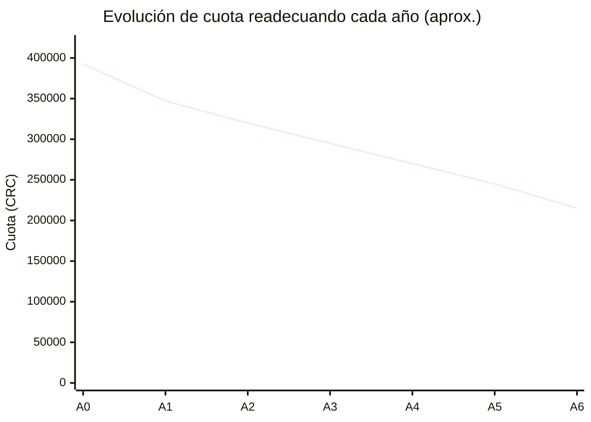
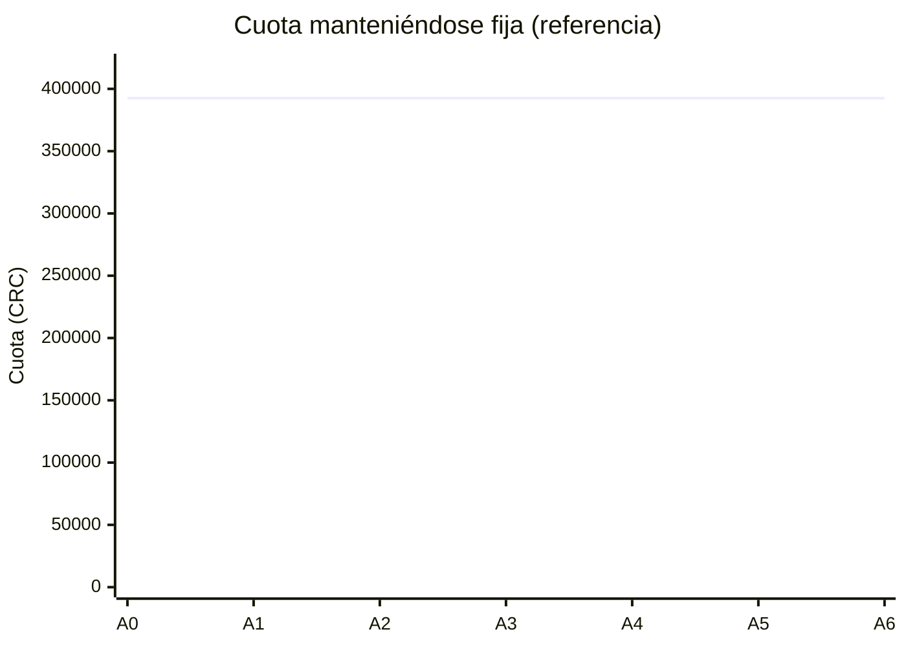
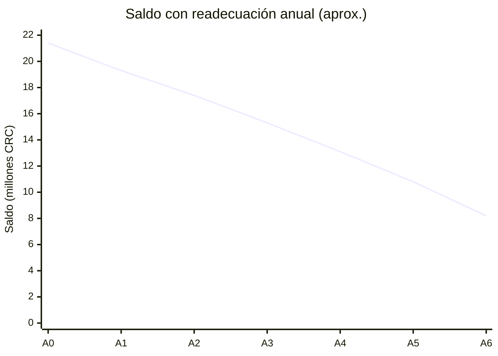
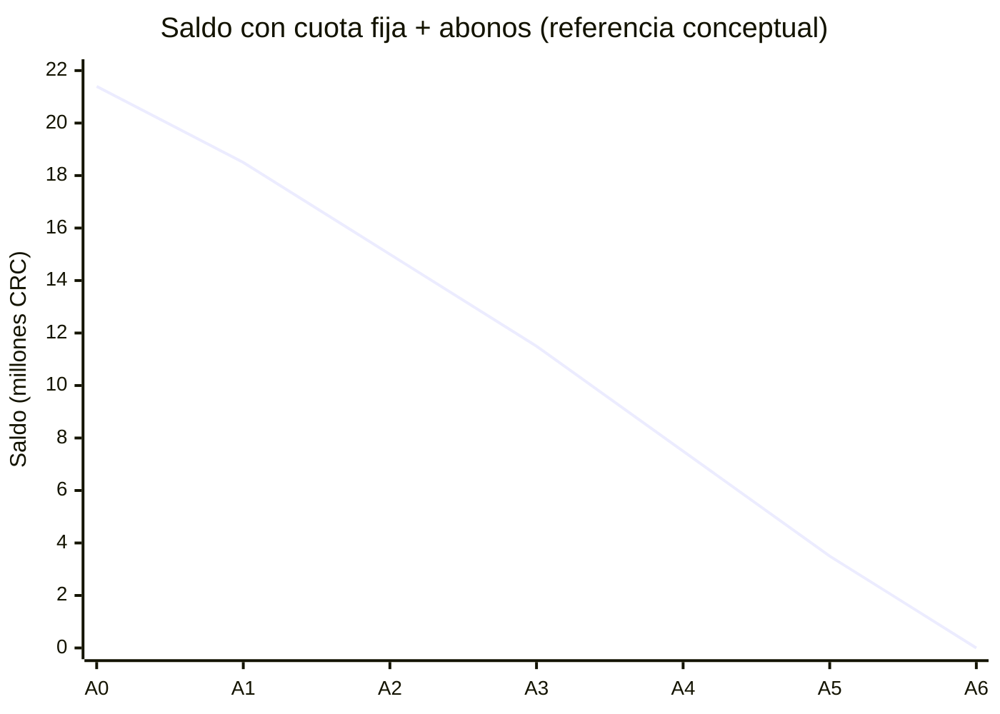
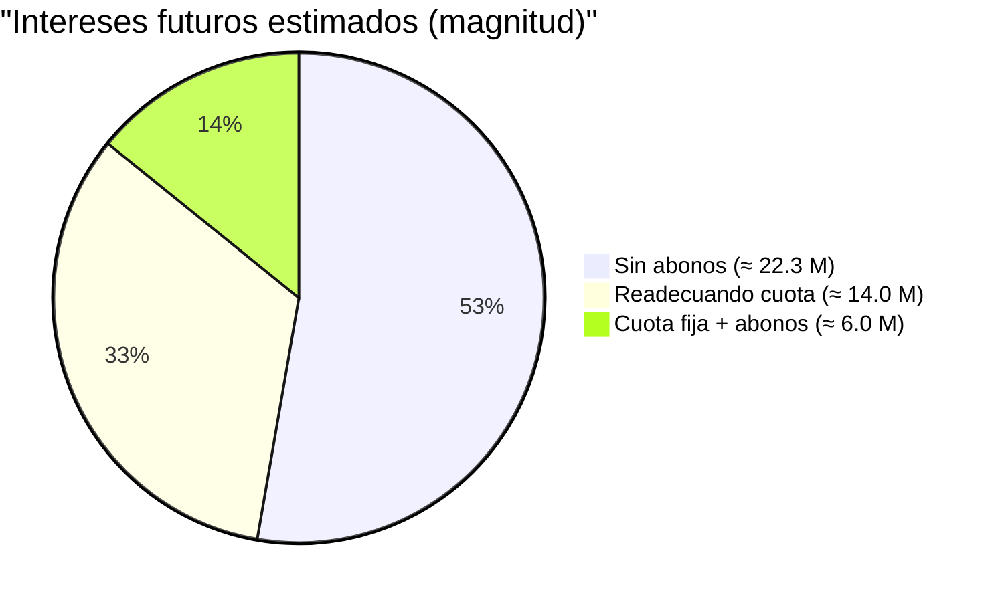

# Análisis de Estrategia de Abonos al Crédito Hipotecario

## 1. Contexto general (resumen)
- Saldo analizado posterior a abono inicial: **₡21.446.847**
- Tasa de interés: **12 % anual (1 % mensual)**
- Sistema de amortización: **Francés**
- Cuota readecuada inicial (referencia): **₡392.500**
- Ahorro mensual inicial que planeas guardar: **₡172.768**
- Ahorro anual estimado (12 meses): **₡2.073.216**

Objetivo: reducir intereses, mejorar liquidez y definir la **línea óptima** para salir del préstamo sin comprometer estabilidad financiera.

---

## 2. Estrategias analizadas (qué hace cada una)
### Estrategia A — Readecuar la cuota cada año (enfoque liquidez)
- Cada año aplicas el ahorro anual al capital y el banco readecua la cuota manteniendo (aprox.) el plazo.
- **Resultado típico:** cuota baja, liquidez mejora, pero el plazo se acelera poco.

### Estrategia B — Mantener la cuota (enfoque salida rápida)
- Aplicar abonos (mensuales y/o anuales) **sin** readecuar cuota.
- **Resultado típico:** el capital cae más rápido, los intereses futuros bajan fuerte, y sí sales antes.

### Estrategia C — Híbrida (recomendada)
- **Años 1–2 (o 1–3):** readecuar para ganar holgura.
- **Luego:** dejar cuota fija y aplicar todo excedente a capital.
- **Resultado:** equilibrio entre liquidez y salida anticipada.

---

## 3. Evolución comparativa de la cuota (gráfico)

> Nota técnica: en Mermaid, los gráficos de líneas se hacen con `xychart-beta`.
> Algunos visores (incluyendo ciertas integraciones) todavía no soportan `xychart-beta`.
> Si no te renderiza en tu visor actual, pruébalo en Mermaid Live Editor o en VS Code con una extensión Mermaid. citeturn0search1turn0search2

### 3.1 Cuota si readecuas cada año (aproximación)

### 3.2 Cuota si NO readecuas (cuota constante de referencia)

---

## 4. Evolución del saldo (comparación conceptual)

### 4.1 Saldo con readecuación anual (aprox.)

### 4.2 Saldo con cuota fija + abonos (más agresivo; referencia conceptual)

---

## 5. Intereses totales estimados (comparación)
> Valores orientativos para comunicar magnitud del impacto (no sustituyen la tabla de amortización del banco).

---

## 6. Conclusión y mejor línea a seguir (recomendación profesional)

### Lo que es cierto con tu plan “ahorro mensual → abono anual → readecuo cuota”
- Sí reduces intereses futuros (ahorro material).
- Sí mejoras liquidez con el tiempo.
- Pero **no maximizas** la salida temprana porque al readecuar reduces la presión de amortización.

### Recomendación óptima (Estrategia híbrida)
1. **Año 1–2 (o 1–3):** readecuar cuota para ganar holgura y estabilidad.
2. **Desde el punto de control:** dejar cuota fija (no readecuar más).
3. Aplicar:
   - abono mensual (aunque sea pequeño y constante) y/o
   - abono anual con lo acumulado,
   **siempre a capital**.
4. Con esto obtienes simultáneamente:
   - liquidez al inicio,
   - salida anticipada después,
   - mayor reducción de riesgo e intereses.

---

## 7. Siguiente mejora del modelo
Si me confirmas:
- saldo exacto hoy,
- si el banco cobra comisión por abonos,
- y si permite “mantener cuota” sin readecuación,
puedo ajustarte una tabla de amortización exacta mes a mes y una hoja Excel que replique el cálculo del banco.
