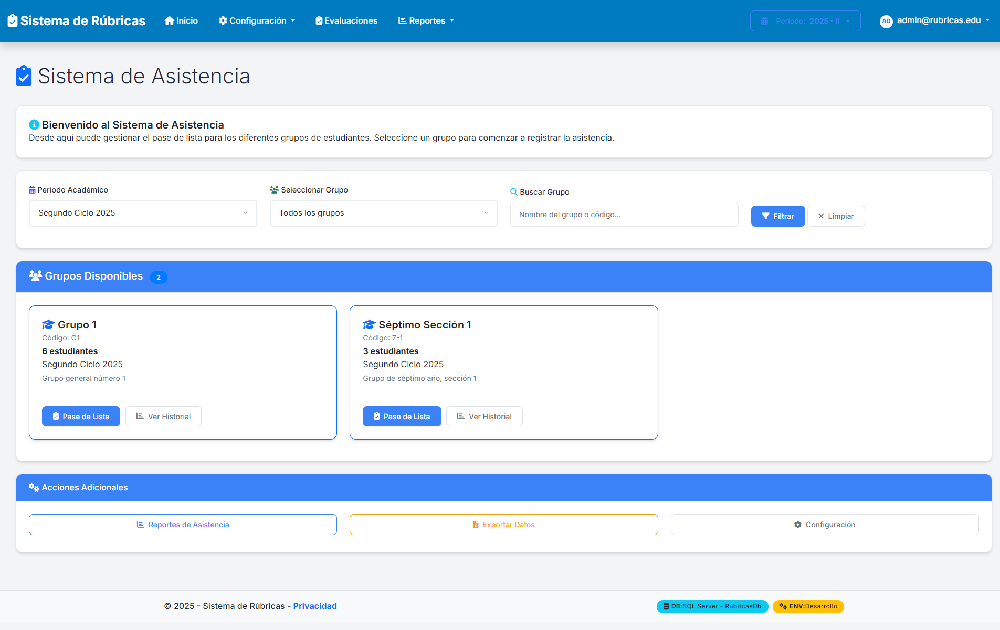
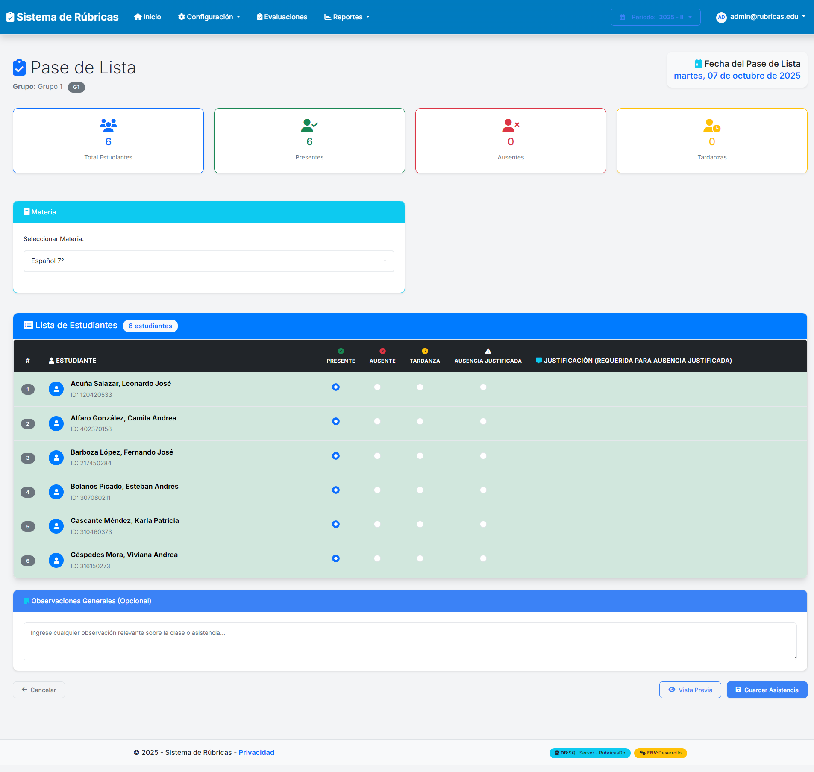
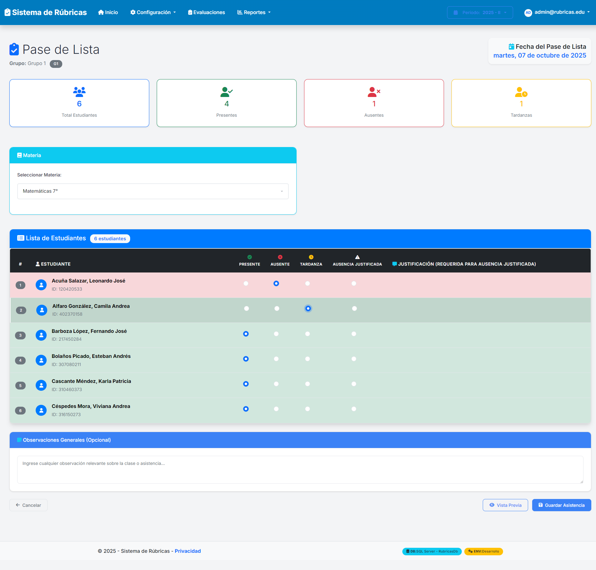
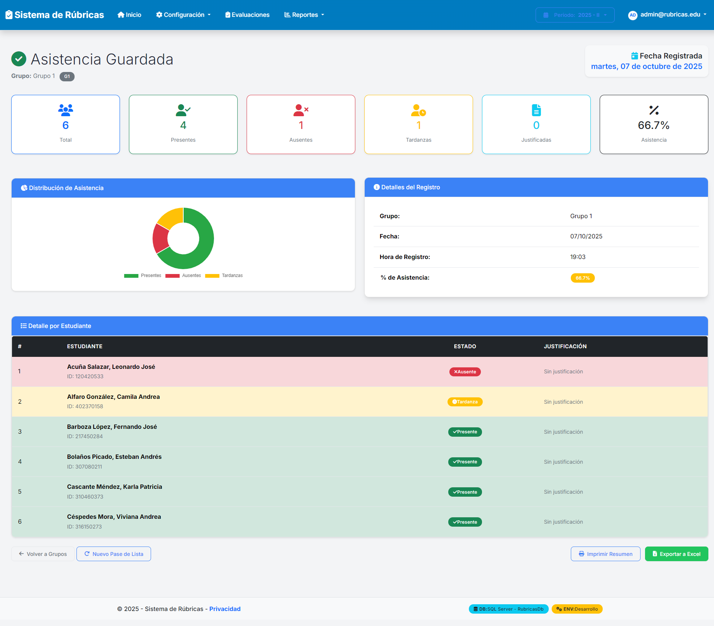
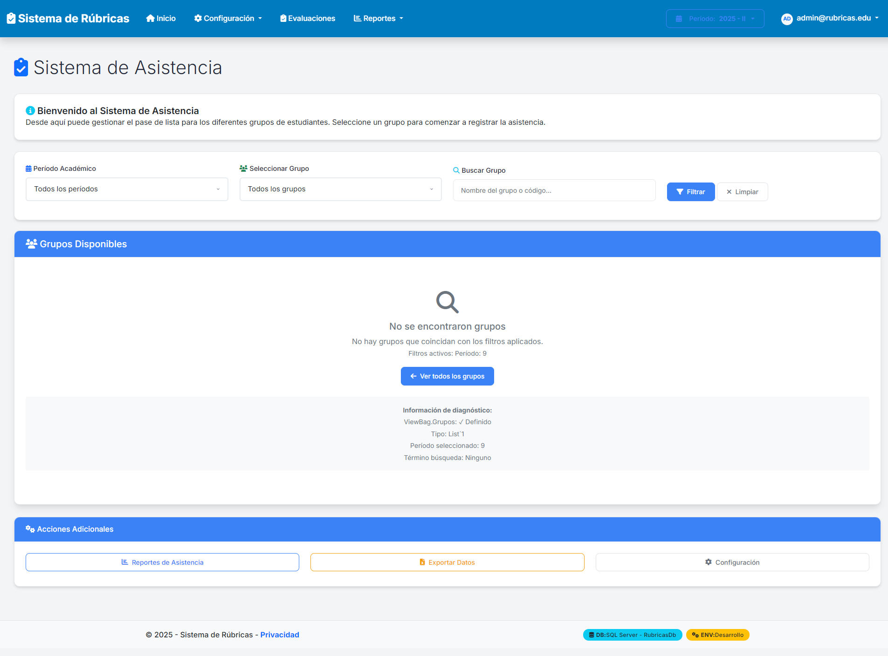

# 📹 Video Demo - Sistema de Asistencia
**Sistema de Rúbricas - Gestión de Asistencia Estudiantil**

---

## 🎯 **Resumen del Demo**

Este video demostrativo presenta el funcionamiento completo del **Sistema de Asistencia** desarrollado para la gestión educativa. El demo muestra cómo los docentes pueden registrar la asistencia de estudiantes de manera eficiente y precisa.

**URL del Sistema:** http://localhost:5002/Asistencia

## 📷 **Galería de Capturas**

| Escena | Descripción | Imagen |
|--------|-------------|--------|
| 1 | Página Principal de Asistencia |  |
| 2 | Formulario de Pase de Lista |  |
| 3 | Marcado de Asistencias Variadas |  |
| 4 | Resumen de Asistencia Guardada |  |
| 5 | Navegación de Retorno |  |

---

## 🎬 **Secuencia del Video**

### **Escena 1: Página Principal de Asistencia**
📸 **Captura:** `asistencia-demo-01-pagina-principal.png`

**Características mostradas:**
- ✅ Interfaz principal del sistema de asistencia
- ✅ Filtros por período académico 
- ✅ Selector de grupos disponibles
- ✅ Búsqueda de grupos por nombre/código
- ✅ Lista de grupos activos con información detallada:
  - **Grupo 1 (G1):** 6 estudiantes - Segundo Ciclo 2025
  - **Séptimo Sección 1 (7-1):** 3 estudiantes - Segundo Ciclo 2025
- ✅ Botones de acción: "Pase de Lista" y "Ver Historial"
- ✅ Sección de acciones adicionales (Reportes, Exportar, Configuración)

---

### **Escena 2: Formulario de Pase de Lista**
📸 **Captura:** `asistencia-demo-02-pase-lista-inicial.png`

**Funcionalidades demostradas:**
- ✅ Formulario de registro de asistencia para el Grupo 1
- ✅ Información del grupo y fecha (martes, 07 de octubre de 2025)
- ✅ Contadores automáticos en tiempo real:
  - Total Estudiantes: 6
  - Presentes: 6 (inicial)
  - Ausentes: 0 (inicial)
  - Tardanzas: 0 (inicial)
- ✅ Selector de materia (inicialmente "Español 7°")
- ✅ Lista completa de estudiantes con opciones de asistencia:
  - Radio buttons: Presente, Ausente, Tardanza, Ausencia Justificada
  - Campo para justificación cuando aplica
- ✅ Área de observaciones generales
- ✅ Botones de acción: Cancelar, Vista Previa, Guardar

---

### **Escena 3: Marcado de Asistencias Variadas**
📸 **Captura:** `asistencia-demo-03-asistencias-marcadas.png`

**Demostración de casos de uso reales:**
- ✅ **Selección de materia:** Cambio a "Matemáticas 7°"
- ✅ **Marcado de diferentes estados:**
  - 🔴 **Leonardo José:** Ausente
  - 🟡 **Camila Andrea:** Tardanza  
  - 🟢 **Otros estudiantes:** Presente
- ✅ **Actualización automática de contadores:**
  - Total: 6
  - Presentes: 4
  - Ausentes: 1
  - Tardanzas: 1
- ✅ **Observaciones agregadas:** Contexto sobre ausencias y tardanzas

---

### **Escena 4: Resumen de Asistencia Guardada**
📸 **Captura:** `asistencia-demo-04-resumen-final.png`

**Resultados del proceso:**
- ✅ **Confirmación de guardado exitoso:** "La asistencia ha sido guardada exitosamente. Se procesaron 6 estudiantes."
- ✅ **Estadísticas finales:**
  - Total: 6 estudiantes
  - Presentes: 4
  - Ausentes: 1
  - Tardanzas: 1
  - Justificadas: 0
  - **Porcentaje de asistencia: 66.7%**
- ✅ **Detalles del registro:**
  - Fecha: 07/10/2025
  - Hora: 19:03
  - Grupo: Grupo 1
- ✅ **Detalle por estudiante** con estados individuales
- ✅ **Opciones de seguimiento:**
  - Volver a Grupos
  - Nuevo Pase de Lista
  - Imprimir Resumen
  - Exportar a Excel

---

### **Escena 5: Navegación de Retorno**
📸 **Captura:** `asistencia-demo-05-vuelta-inicio.png`

**Demostración de navegación:**
- ✅ Retorno exitoso a la página principal
- ✅ Sistema listo para nuevo registro de asistencia
- ✅ Filtros restablecidos a valores por defecto

---

## 🛠️ **Características Técnicas Destacadas**

### **Experiencia de Usuario**
- 🎨 **Interfaz intuitiva** con navegación clara
- ⚡ **Actualizaciones en tiempo real** de contadores
- 📱 **Diseño responsivo** y accesible
- 🔄 **Feedback visual** inmediato de acciones

### **Funcionalidades del Sistema**
- 🎯 **Registro multi-estado:** Presente, Ausente, Tardanza, Justificada
- 📊 **Cálculos automáticos** de porcentajes y estadísticas
- 💾 **Guardado seguro** con validación de datos
- 📋 **Generación de reportes** y exportación
- 🔍 **Búsqueda y filtrado** de grupos

### **Validaciones y Seguridad**
- ✅ **Validación de foreign key constraints** (corregida durante desarrollo)
- 🔐 **Autenticación de usuarios** con claims-based security
- 🛡️ **Manejo de errores** robusto
- 📝 **Logging completo** de operaciones

---

## 🎓 **Casos de Uso Demostrados**

1. **📚 Docente registra asistencia diaria**
   - Selección de grupo y materia
   - Marcado eficiente de estudiantes
   - Agregado de observaciones contextuales

2. **📊 Generación de estadísticas automáticas**
   - Cálculo de porcentajes de asistencia
   - Contadores en tiempo real
   - Distribución por estados

3. **💾 Persistencia y seguimiento**
   - Guardado seguro en base de datos
   - Generación de resúmenes detallados
   - Opciones de exportación y reporte

4. **🔄 Flujo de trabajo completo**
   - Navegación intuitiva entre secciones
   - Opciones de continuidad para nuevos registros
   - Integración con sistema general

---

## 🚀 **Valor Agregado del Sistema**

- **⏱️ Eficiencia:** Reduce tiempo de registro de asistencia
- **📈 Precisión:** Elimina errores manuales de cálculo
- **📊 Insights:** Proporciona estadísticas automáticas
- **🔗 Integración:** Forma parte de sistema educativo completo
- **📱 Modernidad:** Interfaz web moderna y responsive

---

## 🎯 **Conclusión**

El sistema de asistencia demostrado representa una **solución integral y moderna** para la gestión educativa, combinando:

- ✅ **Funcionalidad completa** para registro de asistencia
- ✅ **Interfaz intuitiva** que facilita el trabajo docente  
- ✅ **Tecnología robusta** con validaciones y seguridad
- ✅ **Reportes automáticos** para toma de decisiones
- ✅ **Escalabilidad** para instituciones educativas

**¡El sistema está listo para uso en producción y demuestra las mejores prácticas en desarrollo web educativo!** 🎉

---

*Demo realizado el 7 de octubre de 2025 - Sistema de Rúbricas v1.0*